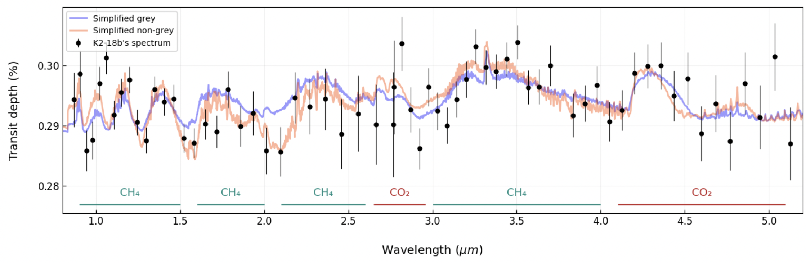

# Atmospheric Retrievals using petitRADTRANS

This repository contains code and analysis tools for performing atmospheric retrievals of Sub-Neptune exoplanets using the petitRADTRANS radiative transfer code. The current implementation focuses on analyzing the atmosphere of K2-18b using the NIRISS (0.9-2.8 μm) and NIRSPEC (2.8-5.2 μm) transmission spectra, which was the scope of my undergraduate thesis work.

I am currently working on extending this analysis to include the recently published MIRI spectrum of K2-18b, and I aim to update this repository regularly as I explore and refine the atmospheric models. The tools implement radiative transfer modeling to constrain atmospheric properties and compositions of this promising exoplanet.


*Transmission spectrum of K2-18b showing the best-fit model for grey (blue line) and non-grey (orange line) models. Non-grey model shows stronger absorption features, while the grey model produces a flatter spectrum. Key spectral features regions of $\ce{CH4}$ and $\ce{CO2}$ are indicated <a href="#Madhu2009">Madhusudhan et al. (2023)</a>.*


## Article

The full manuscript can be found in the `article/` directory. This includes:
- The complete scientific analysis
- Detailed methodology
- Results and discussion
- References

## Usage

The `notebooks/` directory contains several Jupyter notebooks, each implementing a different atmospheric model for K2-18b.

Each notebook can be run independently and includes detailed documentation. To get started:

1. Install the required dependencies (see Dependencies section)
2. Download or clone this repository
3. Launch Jupyter Lab/Notebook in the repository directory
4. Open any notebook of interest and follow the in-notebook instructions

The notebooks are designed to be modular, allowing users to focus on specific aspects of the atmospheric analysis.

## Repository Structure

```
.
├── article/           # Manuscript and related files
├── notebooks/       # Jupyter notebooks for analysis
├── data/           # Spectrum data and other input files
├── models/         # Custom temperature-pressure profile models
└── figures/        # Generated figures and plots
```

## Dependencies

This project requires the following Python packages:

- petitRADTRANS - For radiative transfer modeling and atmospheric retrievals
- MultiNest - For Bayesian inference and nested sampling
- PyMultiNest - Python interface for MultiNest
- numpy - For numerical computations
- matplotlib - For plotting and visualization
- scipy - For scientific computing utilities


## Quick Start

[Add quick start guide here]

## References

<span id="Madhu2009">Madhusudhan, N. and Seager, S., 2009. A TEMPERATURE AND ABUNDANCE RETRIEVAL METHOD FOR EXOPLANET ATMOSPHERES. The Astrophysical Journal, 707(1), pp.24-39. DOI: [10.1088/0004-637X/707/1/24](https://doi.org/10.1088/0004-637X/707/1/24)</span>

<span id="Wogan2024">Wogan, N., Batalha, N., Zahnle, K., Krissansen-Totton, J., and Tsai, S., 2024. JWST observations of K2-18b can be explained by a gas-rich mini-Neptune composition. AAS/Division for Extreme Solar Systems Abstracts, 56, p.625.15</span>

<span id="Benneke2019">Benneke, B., et al., 2019. Water Vapor and Clouds on the Habitable-zone Sub-Neptune Exoplanet K2-18b. The Astrophysical Journal Letters, 887(1), p.L14. DOI: [10.3847/2041-8213/ab59dc](https://doi.org/10.3847/2041-8213/ab59dc)</span>

<span id="Madhu2023">Madhusudhan, N., et al., 2023. Carbon-bearing Molecules in a Possible Hycean Atmosphere. The Astrophysical Journal Letters, 956, p.L13. DOI: [10.3847/2041-8213/acf577](https://doi.org/10.3847/2041-8213/acf577)</span>

<span id="Guillot2010">Guillot, T., 2010. On the radiative equilibrium of irradiated planetary atmospheres. Astronomy & Astrophysics, 520, p.A27. DOI: [10.1051/0004-6361/200913396](https://doi.org/10.1051/0004-6361/200913396)</span>

<span id="Shorttle2024">Shorttle, O., et al., 2024. Distinguishing Oceans of Water from Magma on Mini-Neptune K2-18b. The Astrophysical Journal Letters, 962(1), p.L8. DOI: [10.3847/2041-8213/ad206e](https://doi.org/10.3847/2041-8213/ad206e)</span>

<span id="Feroz2008">Feroz, F., Hobson, M.P., and Bridges, M., 2009. MultiNest: an efficient and robust Bayesian inference tool for cosmology and particle physics. Monthly Notices of the Royal Astronomical Society, 398(4), pp.1601-1614. DOI: [10.1111/j.1365-2966.2009.14548.x](https://doi.org/10.1111/j.1365-2966.2009.14548.x)</span>

<span id="Molliere2019">Mollière, P., et al., 2019. petitRADTRANS: A Python radiative transfer package for exoplanet characterization and retrieval. Astronomy & Astrophysics, 627, p.A67. DOI: [10.1051/0004-6361/201935470](https://doi.org/10.1051/0004-6361/201935470)</span>

<span id="Ackerman2001">Ackerman, A.S. and Marley, M.S., 2001. Precipitating Condensation Clouds in Substellar Atmospheres. The Astrophysical Journal, 556(2), pp.872-884. DOI: [10.1086/321540](https://doi.org/10.1086/321540)</span>

<span id="WASP">Lueber, A., et al., 2024. Information content of JWST spectra of WASP-39b. Astronomy & Astrophysics, 687, p.A110. DOI: [10.1051/0004-6361/202348802](https://doi.org/10.1051/0004-6361/202348802)</span>

<span id="Trotta2008">Trotta, R., 2008. Bayes in the sky: Bayesian inference and model selection in cosmology. Contemporary Physics, 49(2), pp.71-104. DOI: [10.1080/00107510802066753](https://doi.org/10.1080/00107510802066753)</span>

<span id="Rogers">Rogers, L., 2014. Most 1.6 Earth-Radius Planets are not Rocky. The Astrophysical Journal, 801(1), p.41. DOI: [10.1088/0004-637X/801/1/41](https://doi.org/10.1088/0004-637X/801/1/41)</span>

<span id="Batalha">Batalha, N.M., 2014. Exploring exoplanet populations with NASA's Kepler Mission. Proceedings of the National Academy of Sciences, 111(35), pp.12647-12654. DOI: [10.1073/pnas.1304196111](https://doi.org/10.1073/pnas.1304196111)</span>

<span id="Madhu2021">Madhusudhan, N., Piette, A., and Constantinou, S., 2021. Habitability and Biosignatures of Hycean Worlds. The Astrophysical Journal, 918(1), p.1. DOI: [10.3847/1538-4357/abfd9c](https://doi.org/10.3847/1538-4357/abfd9c)</span>

## About Me

I am an astronomer passionate about the study of exoplanets and the search for extraterrestrial life. My research centers on atmospheric retrieval techniques to analyze the chemical compositions and physical properties of exoplanetary atmospheres, with a focus on promising targets such as Sub-Neptunes and Super-Earths. I am particularly interested in how different atmospheric models and retrieval methods can deepen our understanding of these fascinating worlds and their potential to host life.

Feel free to reach out if you have any questions or would like to collaborate!