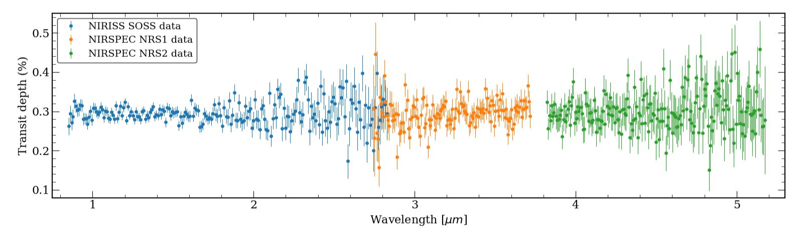

<h1 align="center">Atmospheric retrievals using petitRADTRANS</h1>

This project focuses on atmospheric retrievals for a variety of Sub-Neptune exoplanets. Atmospheric retrievals are a powerful method for characterizing exoplanetary atmospheres by inferring their physical properties, chemical abundances, and other characteristics from an observed spectrum.

This repository contains the Jupyter Notebooks I have developed to evaluate different temperature-pressure profiles, chemical abundance models, and cloud/haze properties in the atmospheres of the analyzed planets. Additionally, the repository includes the spectrum data used in the retrievals and some models for the temperature-pressure profile, not included in the built-in models of <em>petit</em>, that I have developed and used in the retrievals.

The content of this repository is part of my undergraduate thesis and it is a work in progress. I aim to update it regularly as I continue refining the models and exploring new approaches.

<h2> File descriptions</h2>

<h2>Spectra data</h2>
The data used in the retrievals consists of the transmission spectrum of K2-18b in the range between 0.9 - 5.2 μm, obtained with the NIRISS (0.9 - 2.8 μm, R ~ 700) and NIRSPEC (2.8 - 5.2 μm, R ~ 2700) instruments of the JWST. 
The spectrum was reported by <a href="#madhu2023">Madhusudhan et al. (2023)</a> and the high resolution spectrum, along with a low resolution spectrum used for plotting purposes, can be found <a href="https://osf.io/36djh/">here</a>.

    

NIRISS and NIRSPEC spectra overlap in the range between 2.74 and 2.82 μm, which is accounted for in the retrieval workflow.
<h2>Temperature-Pressure profiles</h2>
For the temperature-pressure profiles, I assessed the following models:
<h3>Isothermal model</h3>

This is the simplest model that can be assumed for the temperature profile of an atmosphere. The temperature does not depend on pressure and it is constant throughout the entire atmosphere.

$$
T(p) = T_0
$$

<h3>Guillot (2010)</h3>
A general temperature profile model for irradiated exoplanets, proposed by <a href="#guillot2010">Guillot (2010)</a>. This model assumes that
the incoming radiation field due to the stellar irradiation and the outgoing radiation field due to the thermal emission of the planet are strongly decoupled, so they can be treated separately and the source function can be determined for each of them. Despite this assumption is partially true for highly irradiated planets, if the temperature of the atmosphere at the region where stellar irradiation is absorbed is way lower than the effective temperature of the star, the two radiation fields are mostly decoupled.

If isotropic irradiation is assumed, the temperature profile is given by:

$$
T^4 = \frac{3T_{int}^4}{4}\left[\frac{2}{3}+ \tau \right] + \frac{3T_{irr}^4}{4}f\left[\frac{2}{3} + \frac{1}{\gamma \sqrt{(3)}}+\left(\frac{\gamma}{3}-\frac{1}{\gamma\sqrt{(3)}}\right)e^{-\gamma\tau\sqrt{(3)}}\right]
$$

where $T_{int}$ is the temperature at the bottom of the atmosphere, $T_{irr}$ is the irradiation temperature at the top of the atmosphere, $f$ is a redistribution coefficient which is $f=1$ for the substellar point and $f=1/4$ for an average over the entire surface, $\tau$ is the optical depth, and $\gamma$ is the ratio between the visual and infrared mean opacities.

<h3>Madhusudhan & Seager (2009)</h3>
<h2>Chemical models for abundances</h2>

<h2>Clouds and Hazes parameterizations</h2>

<h2>Provitional results and discussion</h2>

<h2>Retrieval setup</h2>

<h2>References</h2>
Madhusudhan N., Sarkar S., Constantinou S., Holmberg M., Piette A. A. A.,
Moses J. I., 2023, Carbon-bearing Molecules in a Possible Hycean Atmosphere (arXiv:2309.05566)

Guillot T., 2010, On the radiative equilibrium of irradiated planetary atmospheres, Astronomy and Astrophysics (2010) Volume 520, id.A27 (arXiv:1006.4702), doi:10.1051/0004-6361/200913396

<h2>Acknowledgments</h2>
